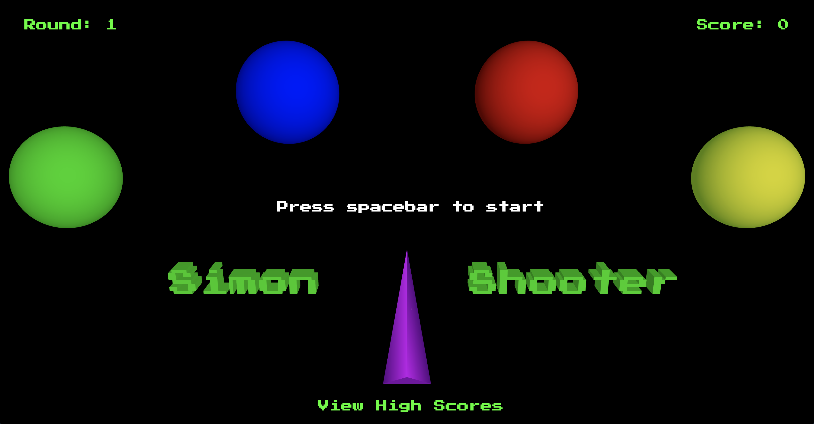
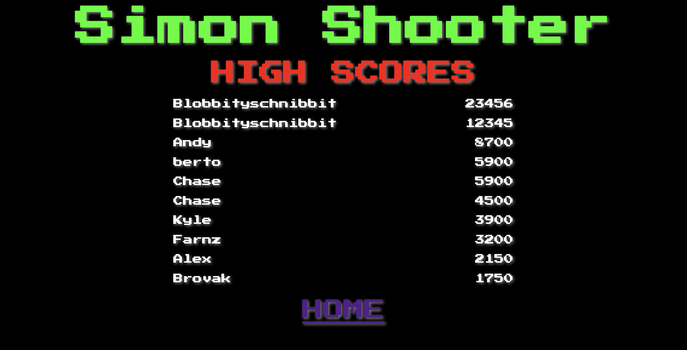

# Simon-Shooter

An old school Simon and Asteroids-style shooter mashup for the modern web

## Link to Deployed app
  - https://simon-shooter.firebaseapp.com/

## To Contribute
  - Fork & Clone
  - Run a local server from the public folder
  - Save your forked version and submit a pull request

## Technologies Used
1. Galvanize Leader-Board API for Scoreboard
  - https://galvanize-leader-board.herokuapp.com/
2. WebGL for 3D Client Side Rendering
3. three.js library to simplify WebGL
  -  https://threejs.org/
4. Web Audio API for sound design
  - https://webaudio.github.io/web-audio-api/
5. HTML
6. CSS
7. JavaScript
8. jQuery

## Upcoming Features
  - Touch Support
  - Responsive for All Platforms
  - More Music for All Features
  - We welcome any and all suggestions for added features
